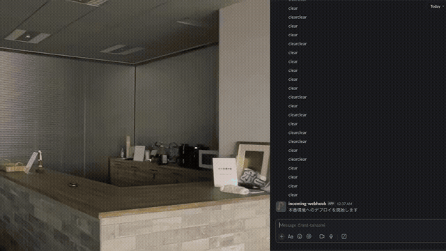

# release-party-5.0

Trigger the Slack message to light up the Philips Hue Smart Bulb.

## Requirements

- Slack
- curl
- Raspberry Pi

### Philips Hue

- [Philips Hue Bridge](https://www.philips-hue.com/en-us/p/hue-bridge/046677458478)
- [Philips Hue Smart Bulbs](https://www.philips-hue.com/en-hk/products/smart-lightbulbs)
- Philips Hue Bridge IP address
- Philips username and device id
  - [Philips Hue Developer: Getting started](https://developers.meethue.com/develop/get-started-2/)

## Reference

- [Doarakko/release-party](https://github.com/Doarakko/release-party)
- [職場を明るくする](https://devblog.thebase.in/entry/work-happy)
